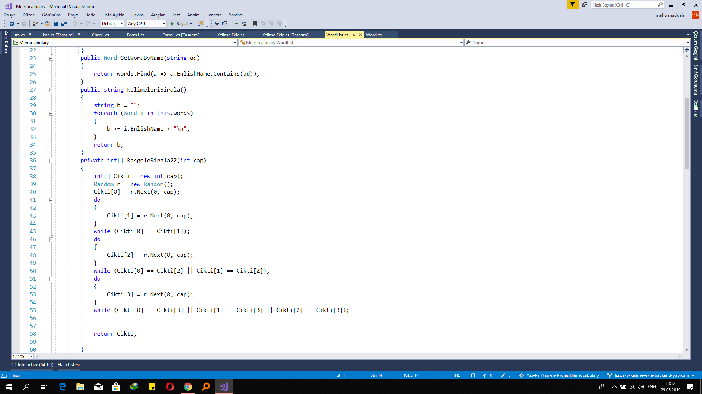

# YazilimYapimiProjesiMemocabulary
NOT: "Issue-3-kelime-ekle-backend-yapicam"
 is the most updated brunch;
Memocabulary is a Windows form app programed in c# which you can add new word list and let program help you to memorize them. i'ts working with English and Turkish.

ScreenShots:

some of the requesments: 

Projemiz bir kelime ezberleme programı
Ana Süreç
Story 1-- Kelimeleri sistem içerisine kaydetmek
Örnek: Apple kelimesini kayıt altına alıyoruz.
Önce Türkçe karşılığı daha sonra
 kelimenin türü(isim-noun-,fiil-verb-,sıfat-adjective-,zarf-adverb- vs.)
Opsiyonel olarak kelimenin geçtiği bir cümle eklenebilir.
Kullanan kişinin eklemek istediği kadar kelime eklenecek.
--------------------------------------------------------------------------
Story 2- Kelimelerin öğrenimi aşaması
Gerçekten ezberlenip ezberlenmediğine yönelik
Kelimeler kullanıcaya bir test olarak sorulacak.
5 şık olacak- şıklarda Türkçe anlamlar yer alacak.
Anlamını bilirse o an için öğrenmiş demektir.
Tekrar edeceğiz test aşamasını.
Öncelikle 1 gün sonra, bilirse 1 hafta sonra, bilirse 1 ay sonra, yine bilirse 6 ay sonra son kez sorulacak. Eğer kullanıcı doğru cevaplarsa öğrenmiş kabul edilecek.
------------------------------------------------------------------------
Story 3- İstatistikler
Ayları ve yılları seçtiğimizde ona göre öğrenilen kelime istatistikleri gelecek.
Saata gore de yaparim
